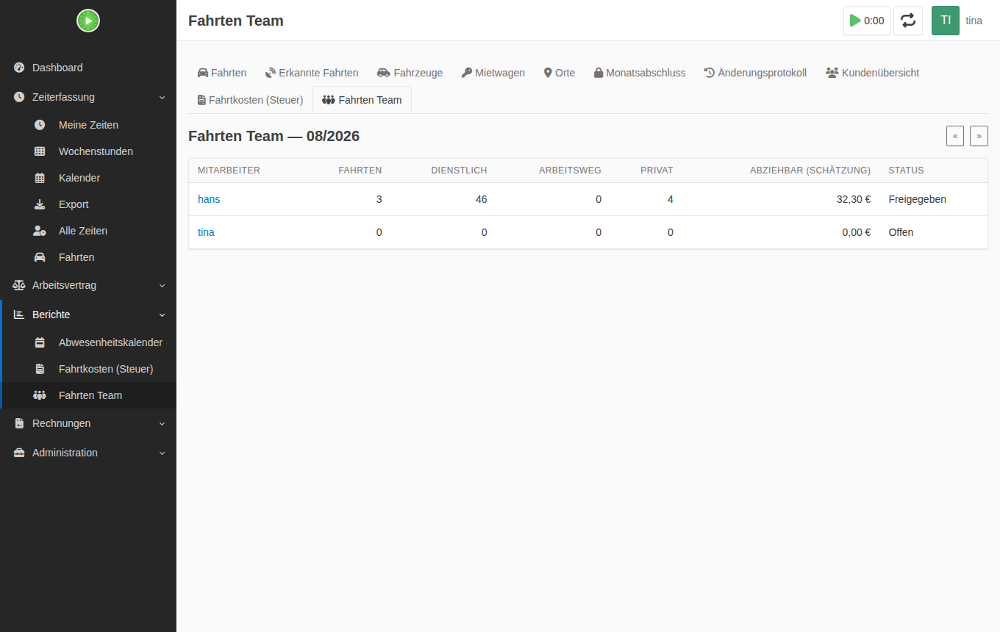

# Fahrten & Fahrtkosten für Kimai (MileageBundle)

Open-Source-Plugin für [Kimai](https://www.kimai.org/): Fahrten erfassen, **automatisch aus der GPS-Historie von
[Dawarich](https://dawarich.app) erkennen** und am Jahresende eine Aufstellung für die Steuererklärung bekommen —
für **Selbstständige (EÜR)** und **Arbeitnehmer (Anlage N)**. Eigenes Auto, Mietwagen, Firmenwagen, Bahn oder Fahrrad
werden jeweils steuerlich passend behandelt.

**Voraussetzung: Kimai ≥ 2.64** (getestet mit 2.67). Berechnungshilfe ohne Gewähr, keine Steuerberatung.

| | |
|---|---|
| **Plugin-ID** | `MileageBundle` |
| **Lizenz** | [GPL-3.0-or-later](LICENSE) |
| **PHP** | ≥ 8.1 |
| **Roadmap** | [ROADMAP.md](ROADMAP.md) |

Das Plugin hat einen eigenen Bereich **Fahrten** in der Seitenleiste (direkt unter Zeiterfassung).


## Funktionen

**Erfassen**
- Fahrten mit Art (Arbeitsweg, Dienstreise, Privat), Fahrzeug, Kennzeichen, Start/Ziel, km, Hin- und Rückfahrt,
  Übernachtung, Kosten, Projekt, Anlass
- „Fahrt erfassen" direkt am Zeiteintrag, Arbeitswege aus Tagen mit Arbeitszeit erzeugen, Fahrten duplizieren
- CSV-Import (erkennt Trennzeichen, Zeichensatz, deutsche/englische Spalten — auch den eigenen Export), REST-API

**Dawarich**
- Strecke für ein Zeitfenster aus GPS-Punkten messen, Kartenvorschau der Strecke
- **Automatische Fahrterkennung**: Stopps und Bewegungen werden getrennt, jede Fahrt landet als Vorschlag.
  Fuß-, Lauf- und Radwege werden über den **Transportmodus von Dawarich** ausgeschlossen (abschaltbar);
  bei Bahn, Bus oder Motorrad wird das passende Verkehrsmittel vorgeschlagen.
  Zuhause ↔ Büro wird als Arbeitsweg vorgeschlagen, Fahrten rund um einen Zeiteintrag beim Kunden als Dienstreise
  mit Projekt. Übernehmen, bearbeiten oder verwerfen.
- Orte (Zuhause, Arbeit, Kunde) anlegen oder aus Dawarich-*Areas* übernehmen, optionale Adressauflösung
  (Nominatim/Photon), nächtlicher Abgleich per Cronjob


**Fahrzeuge & Fahrtenbuch**
- Fahrzeuge mit Kennzeichen, Halter, Nutzungszeitraum, km-Stand, Betriebsvermögen, 1-%-Regel/Fahrtenbuchmethode
- **Mietvorgänge**: Miet- und Tankkosten werden auf alle Mietwagen-Fahrten im Zeitraum nach km verteilt —
  abziehbar ist nur der Anteil der Dienstreisen
- Fahrtenbuch pro Fahrzeug und Jahr mit Prüfung auf km-Stand-Lücken und fehlende Angaben, CSV und Druck/PDF
- **Monatsabschluss** (danach nur mit Sonderrecht änderbar) und **Änderungsprotokoll** für jede Fahrt
- Belege (PDF, Fotos) zu Fahrten und Mietvorgängen


**Steuer**
- Steuerprofil pro Nutzer: **Selbstständig** (Betriebsausgaben/EÜR) oder **Arbeitnehmer** (Werbungskosten/Anlage N)
- Entfernungspauschale mit den **Sätzen des jeweiligen Jahres** (bis 2025: 0,30 € bzw. 0,38 € ab km 21; ab 2026:
  0,38 € ab km 1), einmal pro Tag, 4.500-€-Deckel ohne PKW, höhere ÖPNV-Kosten
- Dienstreisen: eigener PKW 0,30 €/km, Motorrad 0,20 €/km, sonst tatsächliche Kosten; Firmenwagen bzw.
  Betriebsvermögen ohne km-Pauschale
- **Verpflegungsmehraufwand** (14 €/28 €) inkl. mehrtägiger Reisen und Dreimonatsfrist
- Selbstständige: **Privatnutzung** betrieblicher Fahrzeuge (1-%-Regel inkl. E-Auto/Hybrid-Faktor,
  0,03-%-Zuschlag Wohnung–Betrieb, Privatanteil nach Fahrtenbuch)
- **Plausibilitätsprüfung**: Arbeitswege ohne Arbeitszeit, am Wochenende, an Urlaubs-/Krankheitstagen
  (mit dem [HolidayBundle](https://github.com/shrippen/kimai-holiday-bundle)), fehlende Angaben, offene Monate …
- Jahresbericht im Browser und als **PDF**
- **Kundenübersicht**: Dienstreisen je Kunde mit km und Kosten, zum Übertragen in eine Rechnung (z. B. Invoice Ninja)


**Team**
- Optionale **Freigabe durch die Teamleitung**: Monat einreichen → freigeben oder mit Begründung zurückweisen
- Teambericht pro Monat; Teamleitungen sehen nur ihre Teammitglieder



## Installation

```bash
cd /pfad/zu/kimai/var/plugins
git clone https://github.com/shrippen/kimai-anfahrten.git MileageBundle
cd /pfad/zu/kimai
bin/console kimai:reload -n
bin/console kimai:bundle:mileage:install
```

`kimai:bundle:mileage:install` legt die Tabellen an und kopiert die Kartenbibliothek (Leaflet) nach
`public/bundles/mileage`. Bei Updates: `git pull` im Plugin-Ordner und dieselben zwei Befehle.

Docker (offizielles Image):

```bash
docker exec -it CONTAINER /opt/kimai/bin/console kimai:reload -n
docker exec -it CONTAINER /opt/kimai/bin/console kimai:bundle:mileage:install
```

Danach unter **System → Rollen** (Abschnitt *Fahrten*) die Rechte prüfen.

## Einrichtung

1. **Profil → Einstellungen**: Steuerprofil, Wohn- und Arbeitsadresse, Entfernung Wohnung–Arbeit,
   Standardfahrzeug, Kennzeichen, Dawarich-API-Key (in Dawarich unter *Account*) und — falls in den
   Systemeinstellungen erlaubt — eine eigene Dawarich-URL.
2. **Fahrten → Fahrzeuge**: optional Fahrzeuge anlegen (für Fahrtenbuch, km-Stand, 1-%-Regel).
3. **Fahrten → Orte → Aus Dawarich-Areas übernehmen**, oder Orte selbst anlegen.
4. **Fahrten → Erkannte Fahrten → Fahrten erkennen** — oder automatisch per Cronjob:

   ```bash
   # jede Nacht die letzten zwei Tage aller Nutzer mit Dawarich-Zugang
   0 3 * * * /pfad/zu/kimai/bin/console kimai:bundle:mileage:suggest
   ```

**System → Einstellungen** (Abschnitte *Fahrten & Fahrtkosten* und *Fahrten automatisch erkennen*): abweichende
Sätze, Standard-Dawarich-URL, Geocoding-Server, Kartenkacheln (leer = keine Karten), Freigabe durch Teamleitung,
Empfindlichkeit der Fahrterkennung.

Eigene Dawarich-URLs pro Benutzer sind standardmäßig **aus** (*Eigene Dawarich-URL pro Benutzer erlauben*): Die URL
ruft der Kimai-Server auf, ein Benutzer könnte damit sonst interne Dienste im Netz des Servers ansprechen.
Installationen, in denen schon eigene URLs eingetragen sind, bekommen die Einstellung beim Update eingeschaltet.

## Rechte

| Recht | Zweck | Standard |
|---|---|---|
| `mileage` | Fahrten, Berichte, Einstellungen | alle |
| `edit_own_mileage` / `delete_own_mileage` | eigene Fahrten | alle |
| `lock_mileage` | eigene Monate abschließen bzw. einreichen | alle |
| `view_team_mileage` | Fahrten der eigenen Teammitglieder sehen | Teamleitung |
| `approve_mileage` | Monate der Teammitglieder freigeben | Teamleitung |
| `view_other_mileage` / `edit_other_mileage` / `delete_other_mileage` | alle Nutzer | Admin |
| `approve_other_mileage` | alle Monate freigeben | Admin |
| `unlock_mileage` / `edit_locked_mileage` | Monate wieder öffnen / in abgeschlossenen Monaten ändern | Admin |

## REST-API

Authentifizierung mit einem Kimai-API-Token (`Authorization: Bearer …`, *Profil → API-Zugang*).

| Methode | Pfad | |
|---|---|---|
| GET | `/api/mileage/meta` | Arten, Fahrzeugtypen, Steuerprofile |
| GET | `/api/mileage/trips?year=2026&month=9` | Fahrten |
| POST | `/api/mileage/trips` | Fahrt anlegen, z. B. `{"distanceKm": 12.5, "destination": "Kunde"}` oder `{"purpose": "commute"}` |
| GET / PATCH / DELETE | `/api/mileage/trips/{id}` | einzelne Fahrt |
| GET | `/api/mileage/vehicles` | Fahrzeuge |
| GET | `/api/mileage/suggestions` | erkannte Fahrten |
| POST | `/api/mileage/suggestions/{id}/accept` bzw. `/dismiss` | übernehmen (`{"purpose": "business", "vehicle": "own_car"}`) / verwerfen |
| GET | `/api/mileage/tax/2026` | Jahreszusammenfassung |

Beispiel für einen Handy-Kurzbefehl „Arbeitsweg heute":

```bash
curl -X POST https://kimai.example.com/api/mileage/trips \
  -H "Authorization: Bearer $TOKEN" -H "Content-Type: application/json" \
  -d '{"purpose": "commute"}'
```

## Konsolenbefehle

```bash
bin/console kimai:bundle:mileage:suggest [--month=2026-09] [--days=2] [--user=name]
bin/console kimai:bundle:mileage:import fahrten.csv --user=name [--dry-run] [--keep-duplicates]
```

## Entwicklung

```bash
composer install
git clone --depth 1 --branch 2.67.0 https://github.com/kimai/kimai.git .kimai   # für PHPStan
composer check          # CS-Fixer (Prüfmodus), PHPStan Level 6, PHPUnit
```

Browser-Tests gegen ein echtes Kimai mit simuliertem Dawarich: [tests/e2e/README.md](tests/e2e/README.md).
Alles läuft auch in GitHub Actions (PHP 8.1–8.4, PHPStan, E2E auf MariaDB).

## Lizenz

GPL-3.0-or-later — siehe [LICENSE](LICENSE). Enthält [Leaflet](https://leafletjs.com) (BSD-2-Clause,
`Resources/public/leaflet/LICENSE`).
